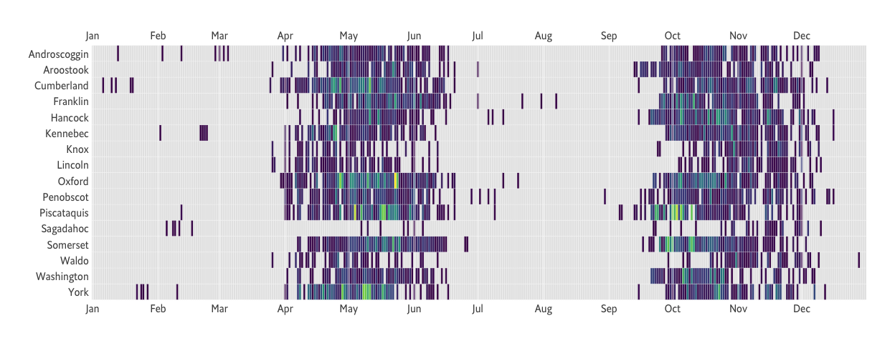

```r
library(hrbrthemes)
library(tidyverse)
```
## Do something with the data!


```r
# altrep/faster read_csv has been broken for me for some time; 
readr::local_edition(1)

# i like to use proper types when reading in data from CSVs 
cols(
  date = col_date(format = ""),
  water = col_character(),
  muni = col_character(),
  species = col_character(),
  qty = col_double(),
  size = col_double(),
  county = col_character()
) -> stocking_cols

xdf <- read_csv("./data/stocking-report.csv", col_types = stocking_cols)
```

### How many stocking events per-year?


```r
xdf |> 
  count(year) |> 
  knitr::kable(format = "markdown")
```


| year|    n|
|----:|----:|
| 2017| 1826|
| 2018| 1843|
| 2019| 1854|
| 2020| 1843|
| 2021| 1882|
| 2022|  241|

### How many stocking events per-year & county?


```r
xdf |> 
  count(year, county) |> 
  ggplot() +
  geom_col(
    aes(year, n)
  ) +
  scale_x_continuous(
    breaks = sort(unique(xdf$year))
  ) +
  facet_wrap(~county, scales = "free_x") +
  labs(
    x = NULL, y = NULL,
    title = "Maine Dept of Inland Fisheries and Wildlife Has a Consistent Annnual Fish Stocking Pattern",
    subtitle = "Each facet shows the number of fish stocking events per-year for a given Maine county",
    caption = "Source: https://www.maine.gov/ifw/fishing-boating/fishing/fish-stocking-report.html"
  ) +
  theme_ipsum_es(grid="Y")
```

<!-- -->

### When does stocking occur and is that consistent across years?


```r
xdf$day <- as.character(xdf$date)
substr(xdf$day, 1, 4) <- "2020"
xdf$day <- as.Date(xdf$day)

xdf |>
  count(day, county = sub(" County", "", county)) |>
  mutate(
    county = factor(county, rev(sort(unique(county))))
  ) |> 
  complete(day = seq(as.Date("2020-01-01"), as.Date("2020-12-31"), "1 day"), county) |> 
  ggplot() +
  geom_tile(
    aes(day, county, fill = n),
    color = "white",
    show.legend = FALSE
  ) +
  geom_vline(
    xintercept = seq(as.Date("2020-01-01"), as.Date("2020-12-31"), "1 month"),
    color = alpha("white", 1/2)
  ) +
  scale_x_date(
    expand = c(0,0),
    date_breaks = "1 month",
    date_labels = "%b",
    sec.axis = dup_axis()
  ) +
  scale_fill_viridis_c(
    na.value = "gray90"
  ) +
  labs(
    x = NULL, y = NULL
  ) +
  theme_ipsum_es(grid="")
```

<!-- -->
